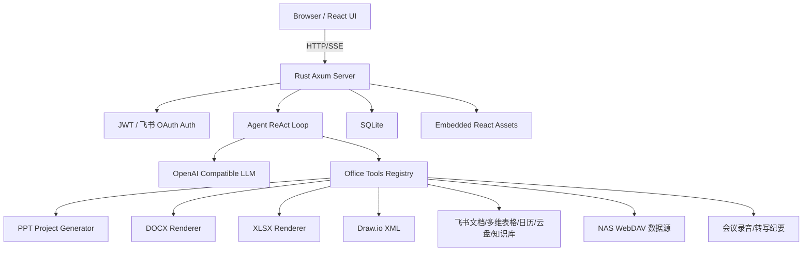

# Moe Office Architecture

## 目标

Moe Office（基于 fuzhengwei/WaLiOffice 二次开发）采用“Rust 服务端 + React 前端嵌入”的标准 Web Agent 架构。生产部署时只需要运行一个 Rust 二进制，即可提供 Web UI、认证、Agent 对话、工具编排、SQLite 持久化、飞书协作、会议纪要、语音播报、NAS 直连 AIGC 与文档导出能力。

## 技术分层

## 后端模块

- `server/src/main.rs`：启动入口，初始化配置、数据库、工具注册和 axum 路由。
- `server/src/config.rs`：环境变量配置，兼容原 `AIPPT_*` 配置项。
- `server/src/db/`：SQLite 连接池、migration、repository。
- `server/src/auth/`：JWT 签发、校验、`AuthUser` 提取器；飞书 OAuth 登录（open_id 去重、自动建号）。
- `server/src/llm/`：OpenAI 兼容 LLM client，包含非流式和流式解析能力。
- `server/src/agent/`：ReAct 循环、上下文压缩、工具注册表、工具执行上下文。
- `server/src/agent/tools/`：内置办公工具：PPT、DOC、Sheet、DrawIO、Image Prompt、视频（单条/批量/分镜）、联网搜索、飞书（文档/多维表格/日历/云盘/知识库）、NAS（WebDAV 文件读写）、会议纪要。
- `server/src/render/`：纯 Rust 文档导出，`docx-rs` 与 `rust_xlsxwriter`。
- `server/src/routes/`：HTTP API、SSE、音频（录音/转写/TTS）、租户管理、静态资源嵌入与 SPA fallback。

## 前端模块

- `frontend/src/pages/`：登录、工作台、Dashboard、文件、任务页面。
- `frontend/src/components/`：Agent 对话、产物展示、PPT 预览等 UI 组件。
- `frontend/src/api/`：统一 API 封装，`/api/chat/stream` 使用 fetch 解析 SSE。
- `frontend/src/stores/`：Zustand 状态管理。

## 部署流程

1. `cd frontend && npm run build` 生成 `frontend/dist/`。
2. `cd server && cargo build --release` 编译 Rust，并通过 `rust-embed` 嵌入前端静态资源。
3. 运行 `server/target/release/walioffice`。
4. 浏览器访问 `http://server:8000`。
